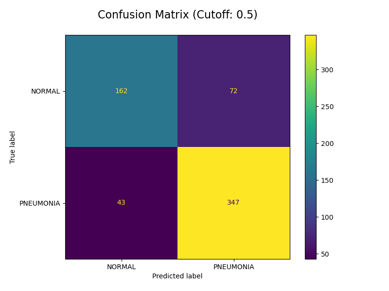

# Project_4_Team_4

# Team Members
- Murali Veerabahu
- Abdifatah Daoud
- Zainab Akinwale
- Priti Patel


# Overview & possible clinical applications

This project builds a Supervised ML Image Classifier to detect pneumonia in paediatric X-ray images. In a hospital setting, the model can help highlight X-rays with pneumonia, which can be incorporated into clinical workflows to reduce human errors of missing abnormalities and highlight abnormal X-rays quickly to clinicians even before formal reports have been completed. In an outpatient setting, the ML tool can be used to find abnormal X-rays and push them up the priority for earlier reporting from the radiology team. The annotated code for the model and evaluation can be found in the Jupyter Notebook called [ml_algo.ipynb](ml_algo.ipynb). The presentation slides for the project can be found in [Google Slides](https://docs.google.com/presentation/d/1WLr92pPxzSDVZye8YKcn5Rp5DeFqCcWM_zsA8WZKYOM/edit?usp=sharing).

# Dataset

We used a [Kaggle dataset](https://www.kaggle.com/datasets/paultimothymooney/chest-xray-pneumonia/data), which had 5,863 X-ray images, to train and test our model. The image below shows the breakdown of the images by group (train, test, validation) and label (normal, pneumonia). As seen, there is an imbalance in the dataset. There are disproportionately more pneumonia images than normal.
`Note:` The dataset from Kaggle is zipped. Both the zipped and unzipped data have been excluded from GitHub for space reasons using `.gitignore`


# Model & data processing
We built a Convoluted Neural Network(CNN) with 3 CNN layers and 2 Dense Layers.

```python
def create_model(img_height, img_width, filter, seed_value, color_channels=1, dropout=0):
    model = models.Sequential([
        layers.Conv2D(32, (filter, filter), activation='relu',
                      input_shape=(img_height, img_width, color_channels)),
        layers.MaxPooling2D((2, 2)),
        layers.Dropout(dropout, seed=seed_value),
        layers.Conv2D(64, (3, 3), activation='relu'),
        layers.MaxPooling2D((2, 2)),
        layers.Dropout(dropout, seed=seed_value),
        layers.Conv2D(128, (3, 3), activation='relu'),
        layers.MaxPooling2D((2, 2)),
        layers.Dropout(dropout, seed=seed_value),
        layers.Flatten(),
        layers.Dense(128, activation='relu'),
        layers.Dense(1, activation='sigmoid')
    ])
    return model
```

We changed a combination of variables to see which produced the model with the best accuracy. The variable (Hyperparameters) changed both aspects of data processing and the model.

### Data Processing Variables
- **Image Size**
  The original images were ~1000 x 800 pixels, and we scaled them to either 300 x 300 or 150 x 150 pixels.

- **Colour Mode**
  The images were converted to 'rgb' (3 Channel) or 'grayscale' (1 channel)

- **Batch Size**
  The dataset was batched in either 16, 32 or 64 images at a time to train the model.

- **Augmentation**
  We used a data augmentation layer for the images to reduce overfitting and increase the dataset. The layer flipped and rotated images.

### Model Variables

- **Epochs**
  After trialling the model, we established no marked gain in accuracy (no reduction in loss) after about 5 epochs. Hence, we varied training from 3 and 5 epochs.

- **Filter Size**
  We applied a filter size to the first CNN Layer of the model, which we changed to 3 x 3 or 7 x 7 pixels.

- **Drop Out**
  We applied a dropout layer to the model, and we varied this between 20% and 50%.

We manipulated 7 parameters to find the optimal model, which gave us 165 iterations or models. Each model's evaluation metric was saved with the parameters to a Pandas Dataframe. The dataframe was saved as a CSV file called [results.csv](output/results.csv). Below is a snapshot of the dataframe showing the best and worst models.


One issue we encountered was that we could not reproduce the exact results every time we ran the code despite sedding the seed to 42. We suspected there may be additional areas in the code, such as data augmentation or pre-processing, where the seed may need to have been set. We accept this as a limitation of our work. To see this variation, additional results.csv files have been saved in the [misc folder](output/misc) for viewing. 

# Results

As seen in the dataframe, our best-performing model had an 87.7% accuracy. We replicated this model using the parameters from the dataframe and saved the model as [xray_pneumonia_model.h5](xray_pneumonia_model.h5). We further evaluated this model using ROC and a confusion matrix to set the decision-making threshold for the classifier.

### ROC


The above figure shows the ROC curve for the model. Eyeballing the graph, the Top Left Corner of the curve falls around 0.8 True predictive rate (TPR). We calculated this Top Left Corner TPR and the threshold for the sigmoid image classification using numpy. The results for this are below, showing the threshold to be 0.6
```
Optimal Threshold (Top-Left Corner)
--------------------------------------------------
Optimal Threshold: 0.6094634532928467
TPR at Optimal Threshold: 0.7974358974358975
FPR at Optimal Threshold: 0.14957264957264957
```

However, in a clinical setting, we do not want to miss any pneumonias and prefer a higher TPR (also known as Sensitivity). We calculated the threshold for 95% sensitivity (TPR). The results are below:
```
Threshold for 95.0% Sensitivity
--------------------------------------------------
Threshold for TPR 0.95: 0.4181900918483734
Actual TPR at this threshold: 0.9512820512820512
FPR at this threshold: 0.49145299145299143
```

### Confusion Matrix
To better understand the thresholds, we created multiple confusion matrices at different thresholds [ 0.3, 0.4, 0.5, 0.6, 0.7 ], which can be found in the [output folder](output). As we are interested in 95% sensitivity with a threshold of 0.3, we have shown the matrices adjacent to this for comparison.




As the threshold increases, the false negative rate for the model increases. This means more X-rays are predicted to be normal when pneumonia is present. We would like to keep this number small. The trade-off for reducing the number of false negatives is a rise in the false positives, which means there would be more normal X-rays predicted as pneumonia. This increased flagging of false positives will increase the workload to clinicians and reduce clinicians' trust in the model.

# Web Test
We tested the model on two pediatric images obtained from Radiopedia.org, one with [pneumonia](https://radiopaedia.org/cases/right-middle-lobe-pneumonia-child?lang=gb) and the other a [normal](https://radiopaedia.org/cases/normal-chest-child) Xray. The results are shown below.

### Normal Xray


### Pneumonia Xray


The model successfully predicted the normal and pneumonia images, with the threshold at 0.4 (95% sensitivity). However, on closer inspection, the prediction score for pneumonia was 0.449, which is just marginally above the threshold.

Conclusion & Limitations

This model shows promising results, but further work will be required to refine the model for clinical use. 

We tried multiple iterations (165 models evaluated), and further hyperparameter changes to the model and preprocessing can potentially improve the model. However, we were limited by the computing power of local machines. Consideration could be given to cloud computing for greater computing power, but information governance and security must be assured when holding healthcare data in the cloud.

As mentioned earlier, we had difficulty reproducing the results despite using a seed for the model, and getting more expert help in image classification can help resolve this.

Exploration can be done by adjusting other parameters such as image brightness and removal of artefacts and labels from the images (e.g., removing the right label from images). Augmenting the image data with additional information such as age and sex may improve the model's ability to learn age and specific changes.

The dataset is imbalanced, with more pneumonia images than normal images. Increasing the dataset to include more normal X-rays can help improve the model's ability to predict normal X-rays better. We could also use cross-validation to improve the model's training.

*~ End ~* 
